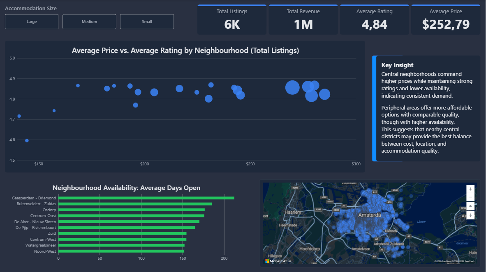
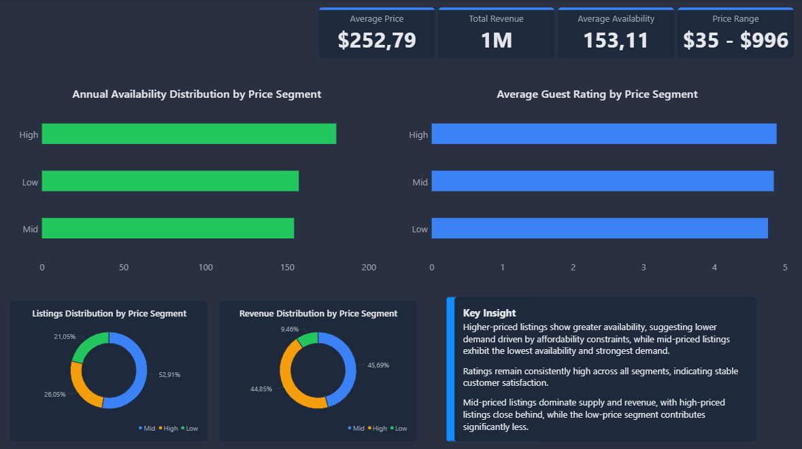
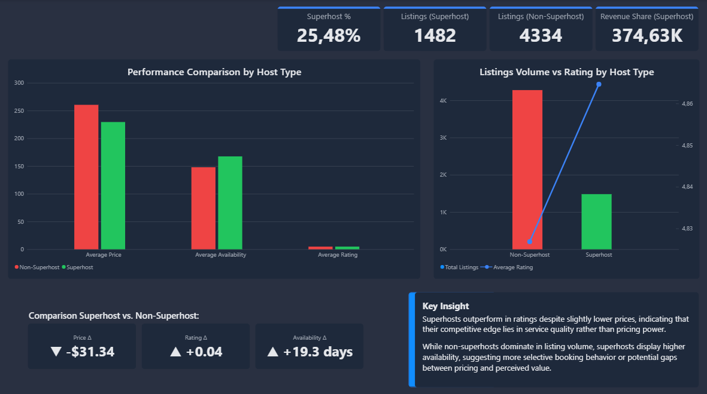
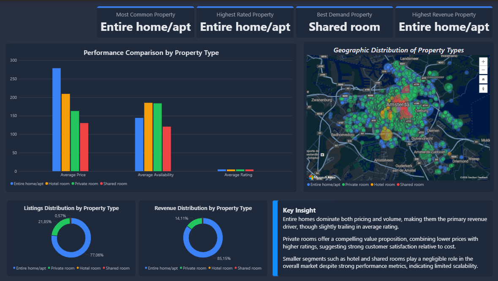

# Amsterdan Airbnb Market Analysis
## Overview
This project analyzes Airbnb listings in Amsterdan, focusing on geographic impact, pricing logic, host performance, and property strategies.
The workflow covers the full data pipeline:
- Data cleaning and preprocessing using Python (Pandas)
- Data modeling and analysis using SQL (SQLite)
- Interactive dashboard development using Power BI

The goal is to extract actionable insight from real-world raw data and present them in a instructive and dynamic business-oriented manner, educating the audience in the Amsterdan Airbnb ecosystem.

## Dataset
The analysis is based on the Airbnb Amsterdam dataset, which includes:
- Listings: property details, pricing, host information
- Reviews: customer feedback and activity
- Calendar: availability and booking constraints

The raw data required significant cleaning due to inconsistent formats, missing values, and redundant fields.

## Data Preparation
The dataset was cleaned and transformed to ensure consistency and usability:
- Converted price and percentage fields into numeric formats
- Standardized boolean values
- Parsed date columns for time-based analysis
- Removed invalid records and extreme outliers
- Reduced dataset to relevant analytical features
- Created occupancy rate derived metric to extract the availability fields full potential

This step ensured the data was structured and ready for analysis.

## Analysis & Dashboard
The cleaned dataset was analyzed using SQL and visualized in Power BI.
The dashboard is structured into four main sections:
1. **Overview**
   - Market-level KPIs and geographic distribution
2. **Price Segmentation**
   - Analysis of low, mid, and high-priced listings
3. **Host Performance**
   - Comparison between superhosts and non-superhosts
4. **Property Strategy**
   - Performance across different property types

Each section focuses on a specific aspect of the market and provides actionable insights.

## Dashboard Preview





## SQL Analysis
SQL queries were used to aggregate and analyze the cleaned dataset.
Each query corresponds to a section of the dashboard:
- Price segmentation
- Host performance
- Neighbourhood analysis
- Property strategy

The queries are available in the `/sql` folder.

## Key Insights
- Central areas have significantly higher prices while maintaining strong ratings and lower availability
- Mid-priced listings dominate the market in volume and revenue
- Superhosts achieve higher ratings but do not charge higher prices
- Entire homes generate the most revenue but do not lead in customer satisfaction
- Private rooms offer strong value with competitive ratings at lower prices

## Tools Used
- Python (Pandas)
- SQL (SQLite)
- Power BI

## Project Structure
```
airbnb-analysis/
│
├── data/   
│   ├── raw/
│   │   ├── listings.csv.gz
│   │   ├── reviews_sample.csv
│   │   └── calendar.csv.gz
│   │
│   └── cleaned/
│       ├── listings.csv
│       ├── reviews.csv
│       └── calendar_sample.csv
│
├── notebooks/
│   └── airbnb-amsterdam-market-analysis.ipynb
│
├── sql/
│   ├── price_segmentation.sql
│   ├── host_performance.sql
│   ├── neighbourhood_analysis.sql
│   └── property_analysis.sql
│
├── powerbi/
│   └── Amsterdan_Airbnb_Dashboard.pbix
│
├── images/
│   ├── overview.png
│   ├── price.png
│   ├── host.png
│   └── property.png
│
└── README.md
```

## What I Learned
- Handling real-world data inconsistencies and missing values
- Structuring datasets for analysis and visualization
- Building end-to-end data workflows from raw data to dashboard
- Translating data into meaningful business insights

## Conclusion

This project demonstrates a complete data workflow, from raw data cleaning to insight generation, with a focus on clarity, structure, and real-world applicability.

## Data Access

Due to file size limitations, the full dataset is not included in this repository.

You can download the original dataset from:
👉 [Inside Airbnb](https://insideairbnb.com/get-the-data/)

A sample of the dataset is provided for reference.
